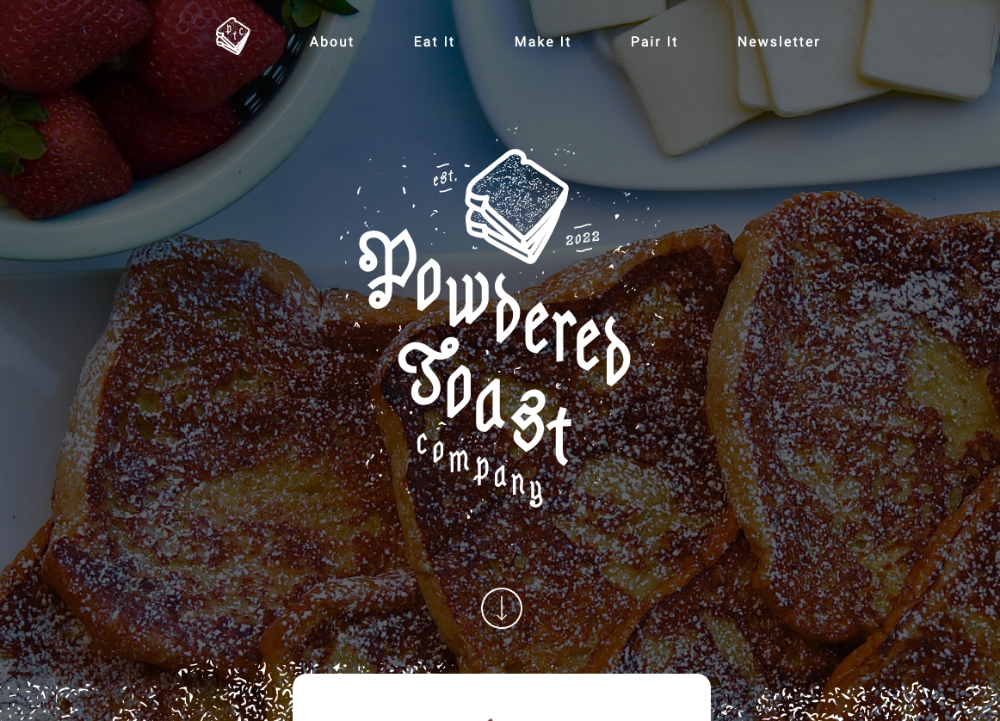
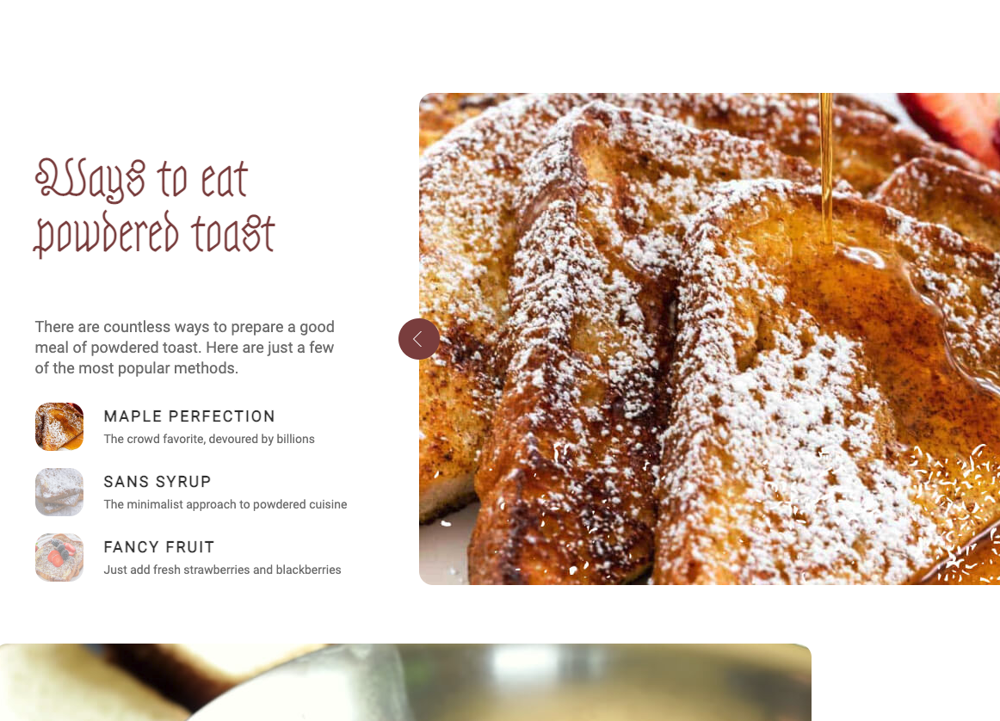

# Powdered Toast - Coding Sample

### This was a coding exercise to try to duplicate a website design from a Figma mockup.

<!-- --- -->
&nbsp;

---
&nbsp;
#### I have never tried to perfectly match a mockup, and this proved quite difficult. Also, I've never worked with SVGs before, and was only successful in changing their color with any control by having the entire SVG inline in the HTML file, which made it rather cumbersome.

&nbsp;

####  
####  

&nbsp;

### Technologies used:
#### * HTML, CSS, SASS, Figma
&nbsp;

### Site can be seen **[here.](https://enbre.github.io/powdered-toast/)**
&nbsp;

### Future development:

#### Finishing styling the site, especially the newsletter section and mobile as I didn't get to address these.